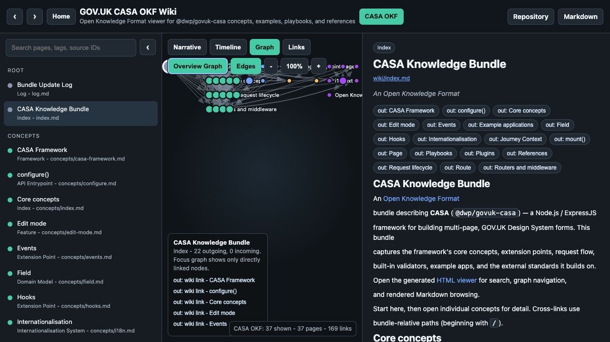
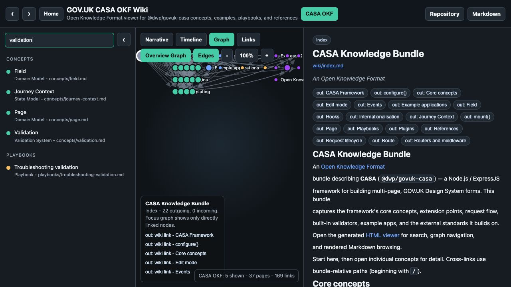
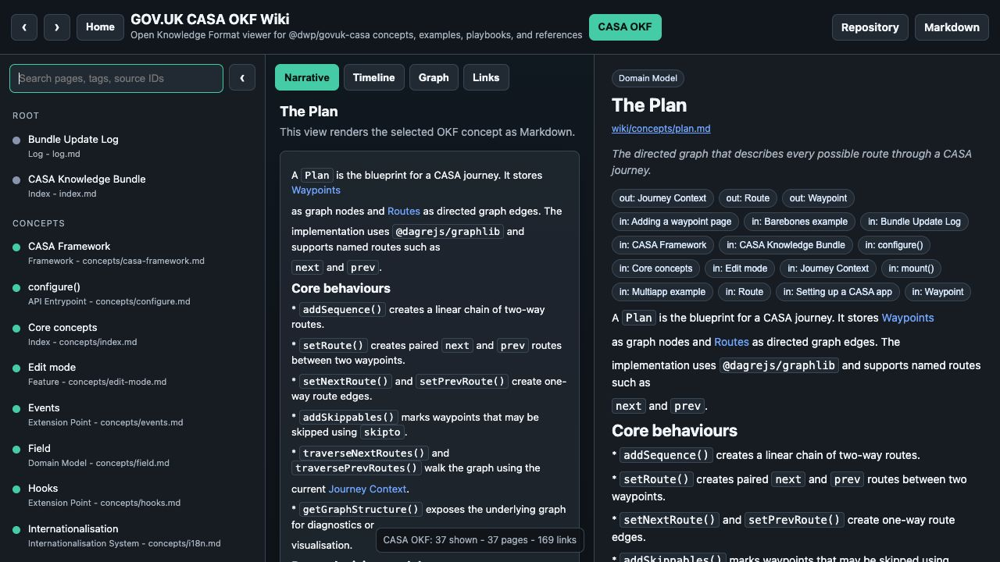
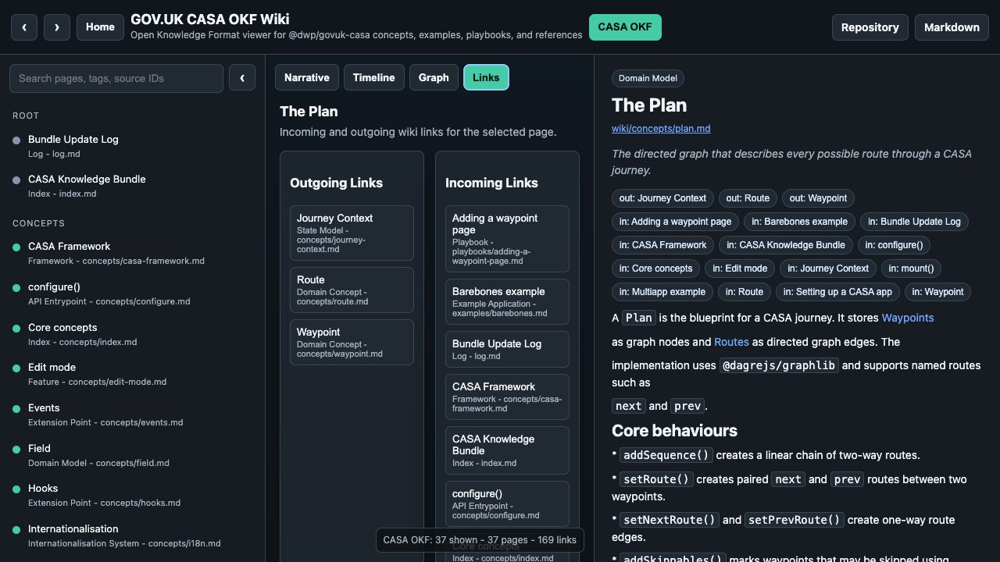
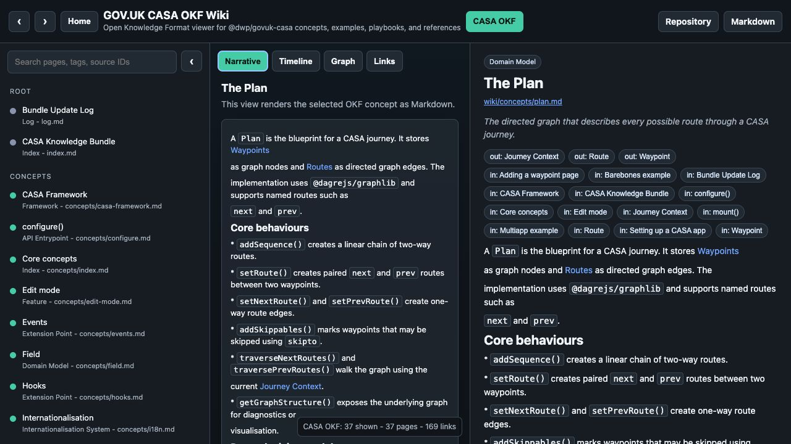

# GOV.UK CASA OKF Viewer User Manual

This manual covers the generated [HTML viewer](../../viewer.html) for this
Open Knowledge Format bundle. The viewer is built from the Markdown files under
`wiki/`, including the [CASA Framework](/concepts/casa-framework.md),
[The Plan](/concepts/plan.md), [Validation](/concepts/validation.md), example
apps, playbooks, and references.

# Open the viewer

Open `viewer.html` from the repository root, or serve the repository locally and
open `/viewer.html` in a browser. The viewer loads the OKF graph from embedded
JSON generated by `scripts/update_viewer.py`.

The header gives access to browser-style back and forward navigation, Home, the
active corpus selector, the upstream repository, and the source Markdown page.



# Layout

The viewer has three main panes:

* The left pane lists pages grouped by section and includes search.
* The centre pane switches between Narrative, Timeline, Graph, and Links views.
* The right pane shows metadata, incoming and outgoing link chips, and rendered
  Markdown for the selected page.

The counter in the lower right of the graph area reports how many pages are
shown, the total page count, and the total directed link count for the corpus.

# Search and filter

Use the search box to filter by title, type, description, tags, source path, or
source ID. Searching for a domain term such as `validation` narrows the left
navigation to matching OKF pages, including the [Validation](/concepts/validation.md)
concept and related playbooks.

Selecting a search result updates the graph, detail pane, link chips, and URL
hash together.



# Browse the directed graph

The Graph view is the fastest way to understand relationships. By default it
shows a focus graph for the selected page: the selected node is central, with
incoming and outgoing linked pages around it.

Use the Graph toolbar to:

* Switch between Focus Graph and Overview Graph.
* Toggle directed Edges on or off.
* Zoom out, reset to 100 percent, or zoom in.
* Click a node to make it the active page.
* Click an edge or an edge row to inspect the relationship source and target.

For example, selecting [The Plan](/concepts/plan.md) highlights links to
[Waypoint](/concepts/waypoint.md), [Route](/concepts/route.md), and
[Journey Context](/concepts/journey-context.md).



# Use Links view

Links view turns the graph relationship data into two lists: outgoing links from
the selected page and incoming links back to it. This is useful when the graph
is dense or when you want to audit how a concept is referenced.

For [The Plan](/concepts/plan.md), outgoing links show the core graph concepts
it depends on, while incoming links show examples, setup guidance, and other
concept pages that point back to the Plan.



# Use Narrative view

Narrative view renders the selected Markdown page in the centre pane. For normal
concepts and playbooks it mirrors the right-hand detail content in a wider
reading area. The right pane remains useful for quick metadata, graph chips, and
source path checks.



# Update the viewer

Markdown is the source of truth. Do not hand-edit `viewer.html`.

After changing pages under `wiki/`, regenerate and check the viewer:

```sh
python3 scripts/update_viewer.py
python3 scripts/check_wiki_viewer.py
python3 scripts/update_viewer.py --check
```

The checker verifies required OKF pages, graph links, route aliases, and whether
`viewer.html` matches the current Markdown corpus.
